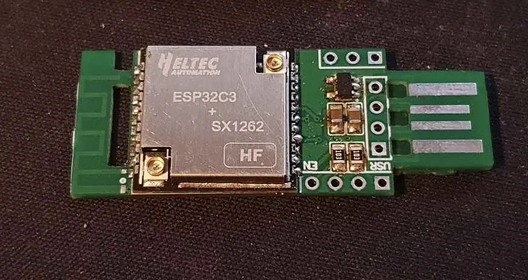

# HT-CT62_USB
PCB carrier for HT-CT62, in the form of a USB stick

## What it is
A PCB carrier for the HT-CT62 ESP32-C3 LoRa node from Heltec, in the form of a USB stick.

## Why this was made
I wanted to make a very small node. In this case, I succeeded. It is 18x46mm when assembled, and extremely small in the hand.

## Current development
I have stopped developing this, as it is higher power than I anticipated, and doesn't suit my needs. I was requested to finish the arrangement of the board and to release it so that others can make some, and I like to see my stuff being used, so here it is.

It is not tested in its current format, but it is in the same schematic as ones I have tested. I have no reason to doubt it will work.

## How to make
Order the PCB at 1mm thickness using JLCPCB. You can use the BOM and P&P files to have them assemble as much as possible if you wish. I recommend assembling these using low-temperature lead-free solder paste and a hot plate.

Once the SMD components are assembled, use wire cutters to remove the reinforcing tab from the end. File the tabs to remove any excess, then glue the reinforcing tab to the back of the USB pads. Use the guide holes to line everything up, and voila! The USB pads can now be used as an unshrouded USB-A plug.

>[!NOTE]
>I have not tested the current V3.1 PCBs, only earlier versions. Build at your own risk!

## License
The Gerber and i-Bom are released under a Creative Commons 4.0 license, under the conditions of Attribution, Non-commercial and non-derivatives [CC-BY-NC-ND](https://creativecommons.org/licenses/by-nc-nd/4.0/). This may seem particularly restrictive, but it is my choice. If you wish to license the design for commercial use or incorporation into another product, then get in touch.

## More info
I have put a lot more info in [my main DIY repo](https://github.com/NomDeTom/NiceRa).

## Credits
Although the design is my own, I took inspiration from the design by [Paul Hausk](https://gitlab.com/paulhausk/CheapMesh/-/tree/main).

I could not have got as far as I have without the ongoing help, support and inspiration of A.li3n, who prototyped my designs and offered a huge amount of help in suggesting fixes for things.

There are many others who have helped me get to where I am today - too many to list. I love each and every one of you.

## Help keep me weird
You don't have to, but if this is useful to you then consider supporting me via https://buymeacoffee.com/nomdetom

I don't make much money from this (nor do I wish to), but hardware development isn't free.
